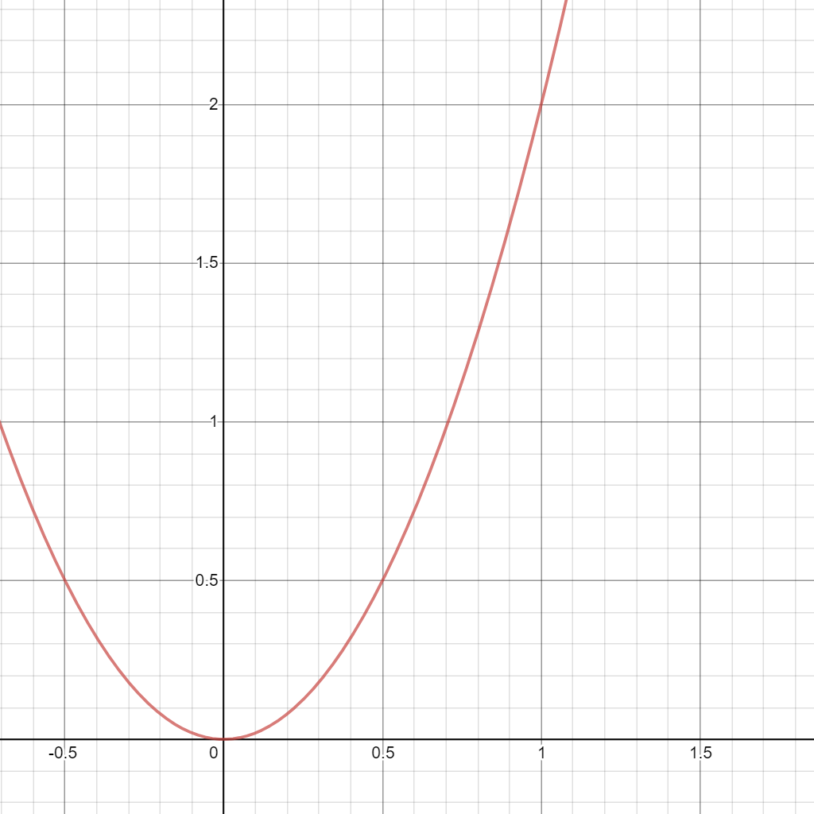
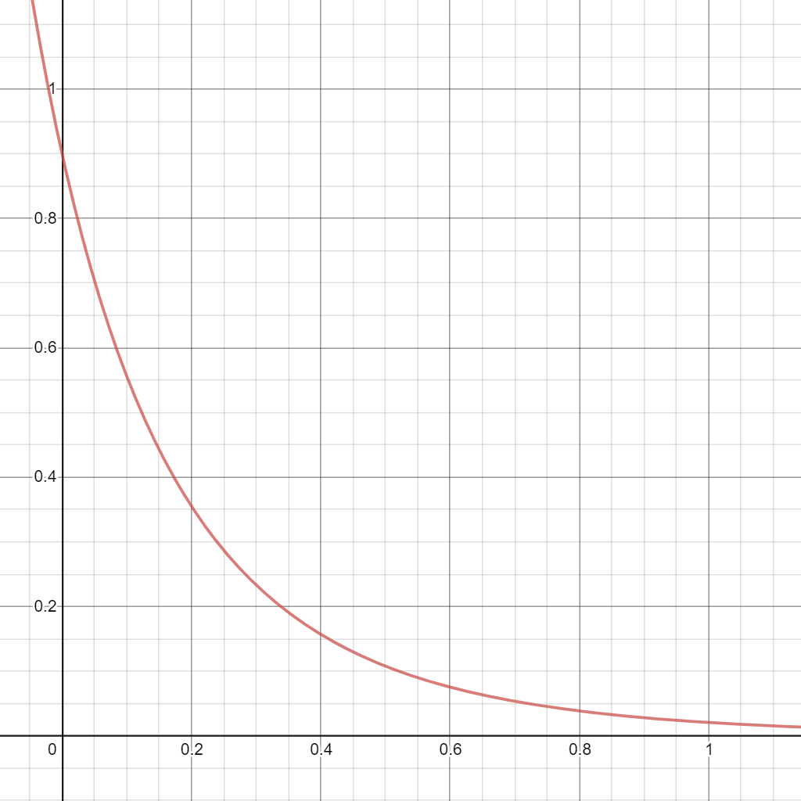

# Maze Agent Trainer

This folder contains all related files for training our maze runner ;).

## Prerequesite / Dependencies
- Tensorflow
- Tensorflowjs (Normally it's not shipped with tensorflow environment, you may need to install it manually.)
- matplotlib
- numpy
- pandas

## `run_trainer.py`
This file is the entry point for our training. Use `python run_trainer.py` to start a training session.

- Args:
  - `--wkdir`
    
    Default value: `./mazes`. You can specify the maze files directoy by setting this argument.

    Example: `python run_trainer.py --wkdir ./output/mazes`

  - `--filename`

    Default value: `m1.csv`. You can specify the training map by setting this argument.

    Example: `python run_trainer.py --filename m10.csv`

  - `--load_path`

    You can load the saved weights from specified weight file by setting up this argument.

    Example: `python run_trainer.py --load_path maze_model.h5`

  - `--save_path`

    You can save weights file to specified path by setting up this argument.

    Example: `python run_trainer.py --save_path saved_weight.h5`

## `unitest.py`
This file is used to see how our current model perform for a specific map.

- Args:
  - `--func_name`

    Default value: `play`. You can define which function to run by setting this argument.

    Example: `python unitest.py --func_name test_map_draw`

  - `--wkdir`. Same meaning as the above section.

  - `--filename` Same meaning as the above section.

## Brief Explanation of Other Files

- `mazemap.py`
  
  This file defines the data structure of our map. It includes functions for both training and testing session, like `act()`.

- `replay.py`
  
  This file defines the "Experience Buffer" for our training session.

- `utils.py`

  Some utility functions for our training and testing.

## Highlight of Our Implementation

### Experience Buffer

We implemented the experience buffer in file `replay.py`. We conduct the actual Q-learning reward update process in this file. Experience buffer is used to boost the performance of training. In the traditional reinforce learning session, the agency only pass the current state into neural network, and learn the weights from current state to the next state. However, with experience buffer, our agent can learn multiple state transitions. With experience buffer, at the end of each episode, current state will be saved in the experience buffer, and a random sampling will be made over all previously saved state and feed these states into the neural network to learn several state transitions at a time. This can potentially decrease the total training time and increase the training performance.

Q-learning Update Codes, in file `replay.py`, from line 82 - 87:
``` python
Q_sa_prev = np.max(self.predict(episode.get_next_state()))
action_idx = int(episode.get_action())
if episode.get_mode() == Mode.END:
    outputs[idx, action_idx] = episode.get_reward()
else:
    # gamme is the discount rate, we use 0.9 in our training
    outputs[idx, action_idx] = episode.get_reward() + self.gamma * Q_sa_prev
```

### Reward Calculation

All reward calculation is done in file `mazemap.py`, in function `cal_reward()`, start at line 147. The lower bound of total reward is initially set to -10. When the total reward goes below the lower bound, this epoch will be terminated, since we consider our agent failed to learn an effective and efficient path.

Theoretically, our agent can go to invalid position, like go into wall, or go beyond the map. However, to handle this problem, every time when our agent try these moves, our agent will receive a -3 reward or penalty in this case. If our agent go back to a previously visited cell, it will get a -2 penalty. If we detect our agent stuck looping on visited cells, it will get a -3 penalty. If our agent perform a new move, it will get a -0.1 + evalution_reward. (I will explain this evalution_reward later.). If our agent reached the final point, it will get a 10 + evalution_reward.

The evalution_reward is calculated based on Manhattan Distance, which is implemented in the file `mazemap.py`, start from line 211. A smaller Manhattan distance between current position and the final postion will get a higher positive reward. In our training, we assume our agent start at top left corner and the final destination is at bottom right corner. Hence the biggest Manhattan distance can be calculated as `self.width + self.height - 2`. Then, we can get a ratio of how far have we approched the final position by `1 - (curr_distance / max_distance)`. This ratio rangs from [0, 1]. Higher value presents closer to the final position. Based on the ratio, a weight is also calculated as $W = 2 \cdot ratio^2$. The final reward is given by $R_{final} = W \cdot {r}$, where W is the weight calculated based on the ratio, and the r is the fixed value (2.5 by default). The reason why we choose $W = 2 \cdot ratio^2$ as weight function is that the increment of weight also increases when the ratio increases. There is also a special case, when our agent is one step away from the final position and still didn't choose that direction, a -3 penalty will be directly returned.

Picture for $W = 2 \cdot ratio^2$:


### Epsilon Decaying

An optimization on epsilon is also implemented. Epsilon is the ratio of exploration vs exploitation. Higher epsilon prefers exploration and lower prefers exploitation. Exploration means randomly choose a direction, in spite of what we have learned before. Exploitation means directly choose the ideal direction learned from the previous training. Hence a proper epsilon can help balance the exploration and exploitation and give our agent the chance to explore the global optimal path instead of insist on the learned pattern, which might not be a global optimal path. Set a constant epsilon is not ideal. For example, when we just start the training, the ideal epsilon should be relative high, namely prefer explorations. However, when near the end of training, we prefer a lower epsilon, as we don't want our agent keep aimlessly wandering around the map. Due to this, a decaying epsilon is implemented. The calculation of epsilon is based on the `win_rate`, which ranges from [0, 1]. The formal equation for epsilon is $epsilon = 0.9 \cdot {e^{-x}\over{(x+1)^4}}$, where e is the natural number and x is the `win_rate`.

Picture of Decaying Epsilon:

